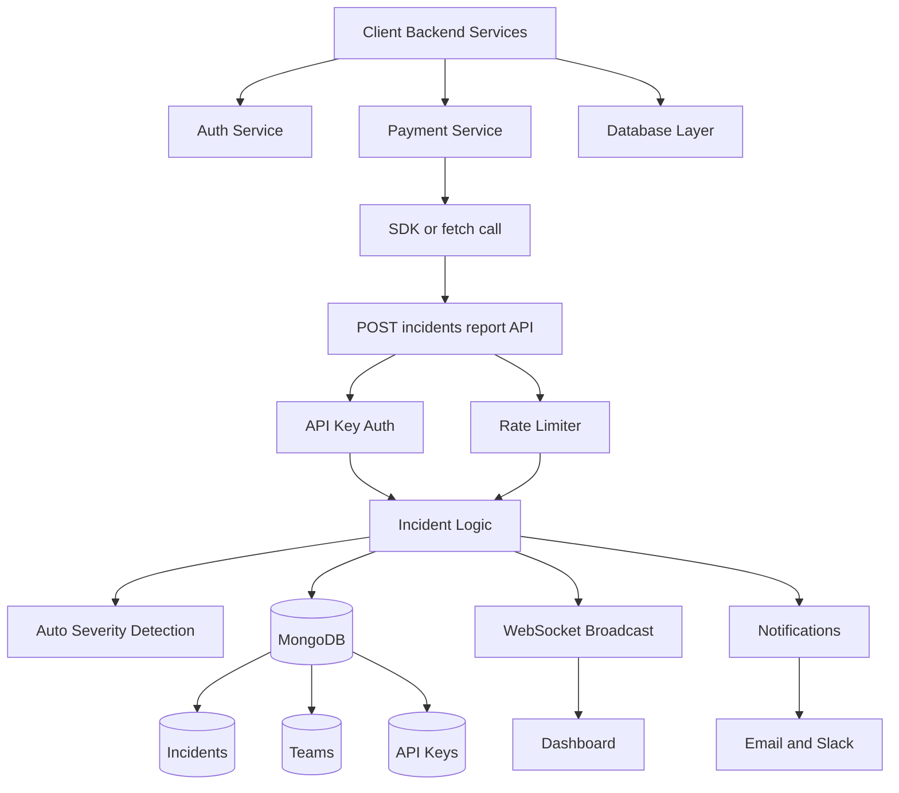
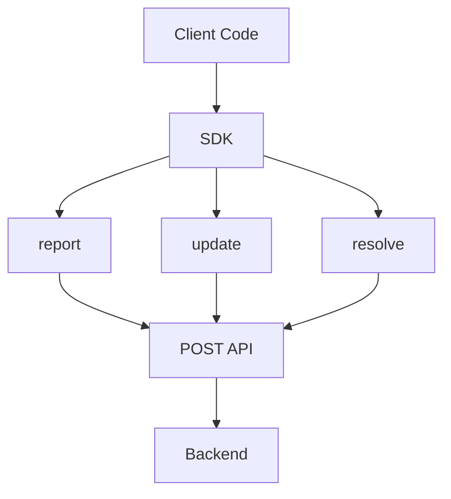
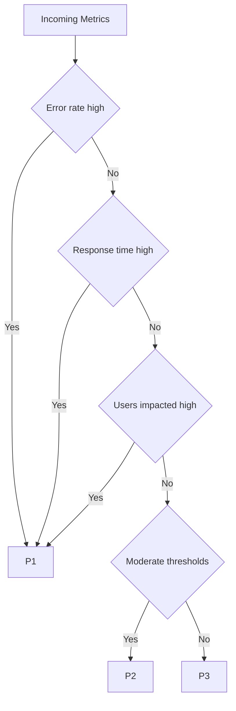
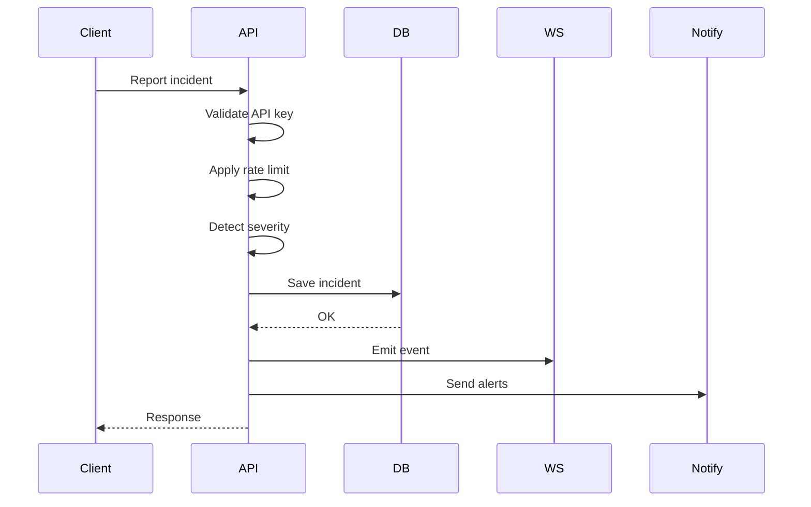

### 🔥 Root causes (in your file)

1. Some diagrams still have **implicit chaining / compact syntax**
2. Some node labels contain characters like:

   * `/` (e.g. `POST /api/...`)
   * `()` (e.g. `report()`)
3. GitHub Mermaid sometimes breaks unless labels are wrapped safely

---

## ✅ ✅ FULLY FIXED (GitHub-safe versions)

Replace your diagrams with these **exact versions**.

---

# ✅ 1. Full System Architecture (FIXED)

---

# ✅ 2. SDK Flow (FIXED)

---

# ✅ 3. Severity Flow (SAFE VERSION)

---

# ✅ 4. Request Lifecycle (SAFE)

---

# 💡 WHY THIS WORKS (important)

GitHub Mermaid **breaks on these patterns**:

❌ `B -->|POST /api/...|`
❌ `report()`
❌ multiple edges on one line
❌ special characters inside node labels

---

# ✅ Safe Rules (follow these ALWAYS)

* ✅ One arrow per line
* ✅ No `/` in labels → use words instead
* ✅ No `()` → use plain text
* ✅ Keep labels simple
* ✅ Avoid fancy inline syntax

---

# 🚀 Quick sanity test

If a diagram breaks, simplify labels like this:

| ❌ Bad                        | ✅ Good       |
| ---------------------------- | ------------ |
| `POST /api/incidents/report` | `Report API` |
| `report()`                   | `report`     |
| `SDK / fetch()`              | `SDK call`   |

---

