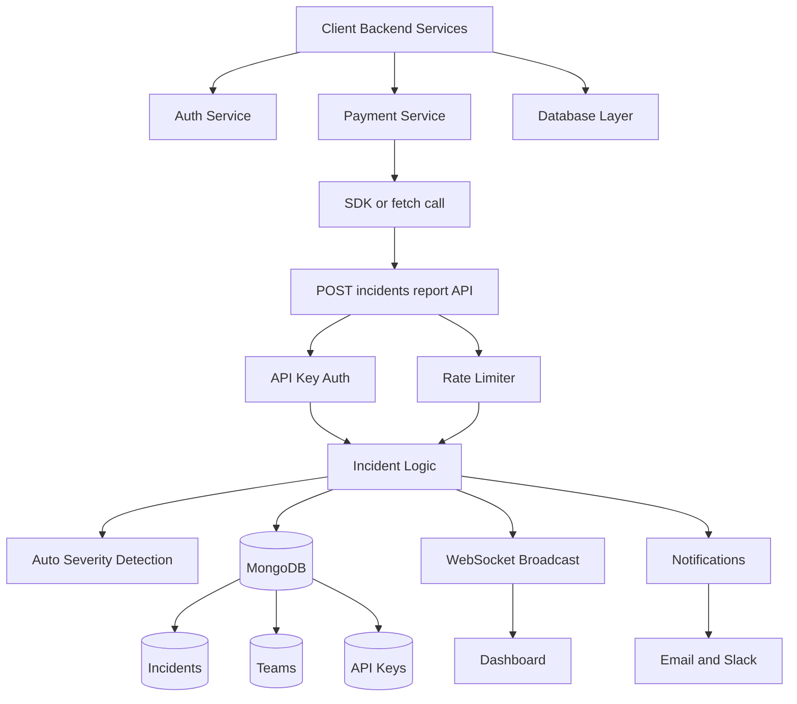
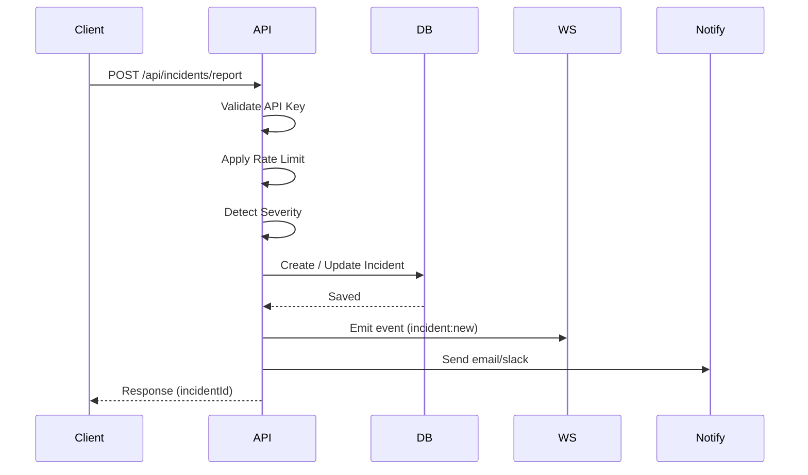
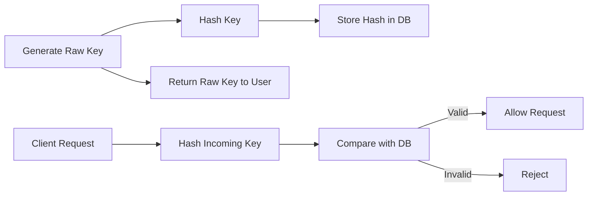
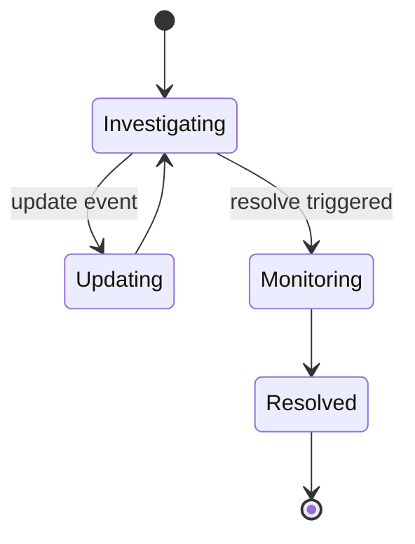
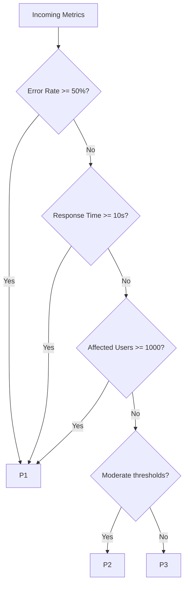
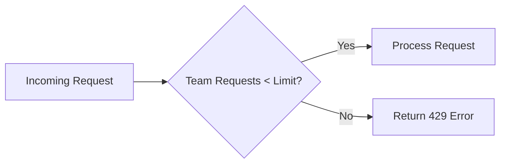
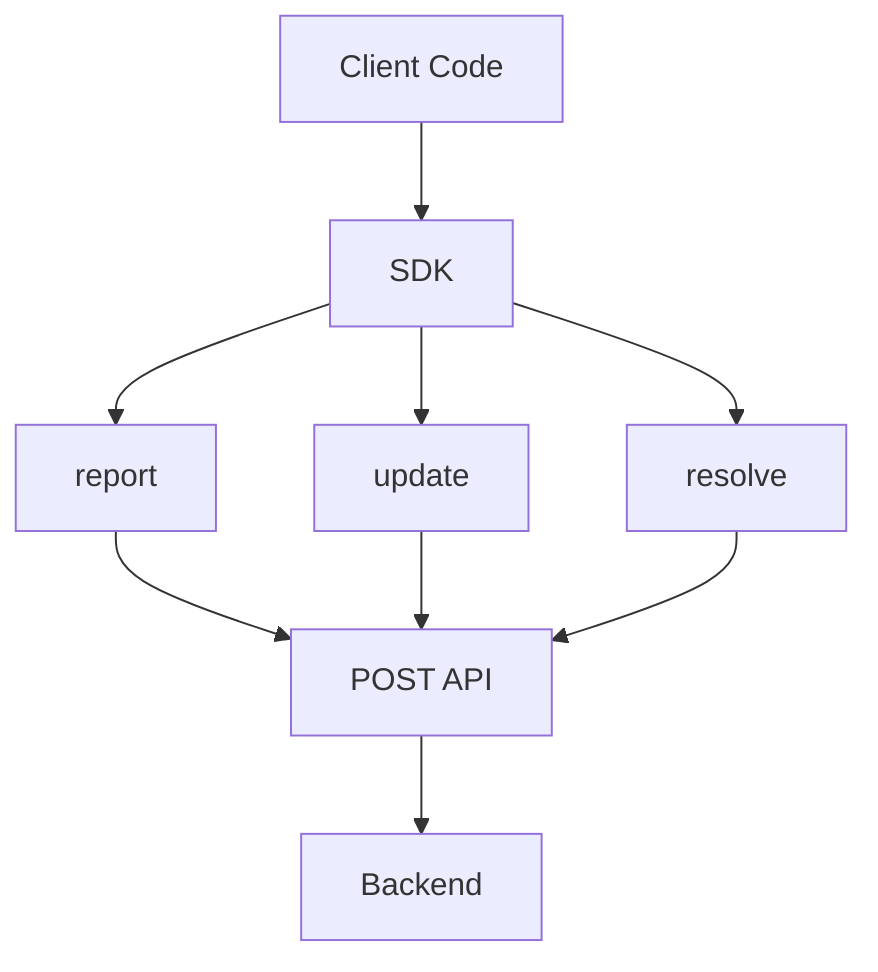
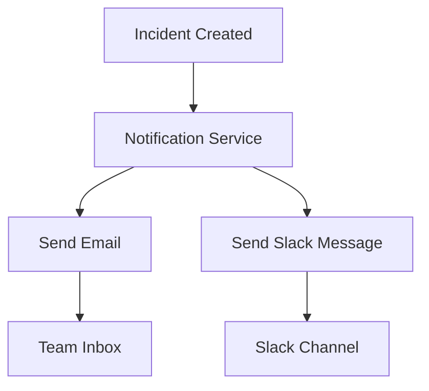
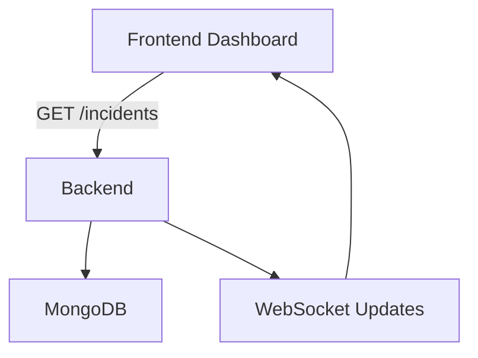

Perfect — this is your **“Pattern B: Self-Reporting Integration”** doc. I’ll format it like a clean, production-style `.md` with **Mermaid diagrams + architecture clarity** so you can drop it into GitHub or pitch slides.

---

# 📄 Self-Reporting Integration (Client SDK + API)

## 🧠 1. What This Feature Is

This is your **advanced integration layer**.

Instead of relying only on external monitors (like UptimeRobot), clients can:

> 📢 **Report internal failures directly from their backend**

Examples:

* Database connection pool exhausted
* Payment service throwing errors
* Auth service failing JWT validation

---

## 💡 Core Idea

Client adds **~10 lines of code** (or uses your SDK):

```js
await fetch('https://yourapp.com/api/incidents/report', {
  method: 'POST',
  headers: {
    'Content-Type': 'application/json',
    'X-API-Key': 'ip_abc123'
  },
  body: JSON.stringify({
    service: 'Payment API',
    errorRate: 0.72,
    affectedUsers: 340
  })
});
```

---

## 📊 Mermaid: Full System Architecture



---

## 🔄 2. End-to-End Flow

### Step 1: Client backend detects error

Example:

* Payment API throws 500s
* Error rate spikes

---

### Step 2: Client reports incident

Via SDK or `fetch()`

---

### Step 3: Your backend receives request

```http
POST /api/incidents/report
```

Headers:

```
X-API-Key: ip_abc123
```

---

### Step 4: Middleware pipeline

```txt
API Key Auth → Rate Limiter → Incident Logic
```

---

### Step 5: Incident handling

* Create / update / resolve incident
* Auto-detect severity
* Store in DB
* Broadcast via WebSocket
* Send notifications

---

## 📊 Mermaid: Request Lifecycle



---

## 🗂️ 3. Folder Structure

```txt
incident-platform/
├── models/
├── routes/
├── middleware/
├── services/
├── socket/
└── sdk/
```

### Key idea:

* **models/** → DB schema
* **routes/** → API endpoints
* **middleware/** → auth, limits
* **services/** → business logic
* **sdk/** → client integration

---

## 🧩 4. Database Design

### Teams

```json
{
  "name": "Acme Corp",
  "services": ["Payment API", "Auth"]
}
```

---

### API Keys

```json
{
  "teamId": "...",
  "keyHash": "sha256...",
  "label": "Production"
}
```

---

### Incidents

```json
{
  "title": "Payment API failure",
  "severity": "P1",
  "status": "investigating",
  "source": "api"
}
```

---

## 🔐 5. API Key System

### Key Principles

* Never store raw API keys
* Always hash (SHA-256)
* Return raw key **only once**

---

### Flow



---

## 🚀 6. Report Endpoint Behavior

### Modes

| Action  | Behavior           |
| ------- | ------------------ |
| create  | New incident       |
| update  | Add timeline event |
| resolve | Close incident     |

---

## 📊 Mermaid: Incident State Flow



---

## 🧠 7. Auto Severity Detection

### Logic

* P1 → critical
* P2 → major
* P3 → minor

---

### Rules Visualization



---

## ⛔ 8. Rate Limiting (Per Team)

### Why?

* Prevent spam
* Prevent accidental loops
* Protect infrastructure

---

### Design

* Limit: 60 req/hour
* Key: **teamId (NOT IP)**

---

### Flow



---

## 📦 9. Client SDK (Your Secret Weapon)

### Why it matters

This is exactly how tools like:

* Sentry
* Datadog

win developers.

---

### Client Usage

```js
const reporter = new IncidentReporter({ apiKey: 'ip_abc123' });

await reporter.report('Payment API', 'Stripe failing', {
  errorRate: 0.6
});

await reporter.resolve('Payment API');
```

---

### SDK Behavior



---

## 🔔 10. Notifications System

### Channels

* Email (Nodemailer)
* Slack (Webhook)

---

### Flow



---

## 🖥️ 11. Team Dashboard

### Features

* Incident list
* Timeline view
* Analytics (MTTR)
* Public status page

---

### Public Status API

```http
GET /api/status/:teamId
```

Returns:

* Active incidents
* Recent history
* Overall status

---

### Dashboard Data Flow



---

## 🧠 12. How This Differs from UptimeRobot

| Feature                | UptimeRobot | Your System |
| ---------------------- | ----------- | ----------- |
| Detect downtime        | ✅           | ❌           |
| Detect internal errors | ❌           | ✅           |
| Root cause hints       | ❌           | ✅           |
| Team collaboration     | ❌           | ✅           |
| SDK integration        | ❌           | ✅           |

---

## 🔥 13. Pitch Line (Use This)

> “We support both external monitoring (via webhooks) and internal self-reporting via a lightweight SDK, allowing teams to capture outages that traditional uptime tools cannot detect.”

---

## ⚡ 14. Mental Model

* **UptimeRobot** → detects “site is down”
* **Your SDK** → detects “why it’s down”

Together:

> Full observability loop 🔥

---

## ✅ Why This Is Powerful

* Works for **internal failures**
* Minimal client effort (3–10 lines)
* Scales across services
* Industry-grade pattern
* Huge differentiator in demos

---

## 👍 If you want next level

I can extend this into:

* 🔐 HMAC webhook verification (production security)
* 🧱 Full DB schema diagrams
* ⚡ Redis-based rate limiting (real-world scale)
* 🧠 AI root-cause pipeline design
* 🎯 Pitch deck version (slides)

Just tell me what you want next.
