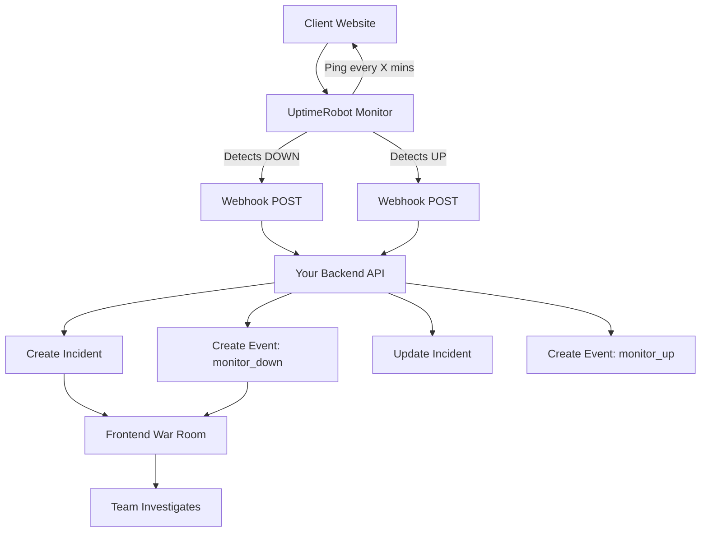
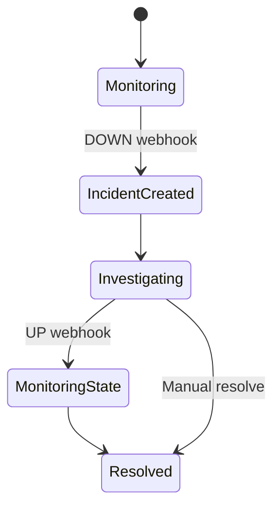

Yes — this is actually a great candidate for a clean `.md` doc **plus** Mermaid diagrams. I’ll structure it so you can drop it straight into GitHub / Notion.

---

# 📄 UptimeRobot Integration (Webhook-Based Monitoring)

## 🧠 1. What is UptimeRobot?

UptimeRobot is an external monitoring service that periodically checks whether a website or API is reachable.

### 🔁 How it works

* Every X minutes:

  * Sends HTTP request to your service

    ```
    GET /health
    ```
* If response = `200 OK` → 🟢 **UP**
* If timeout / error → 🔴 **DOWN**

### 🚨 When status changes

UptimeRobot triggers alerts when:

* UP → DOWN
* DOWN → UP

It can notify via:

* Email
* SMS
* Slack
* **Webhook (used in this system)**

---

## 🔗 2. System Integration Flow

### 💡 High-level idea

Client configures UptimeRobot → UptimeRobot sends events → Your backend handles incidents

---

## 📊 Mermaid: Full System Flow



---

## 🧭 3. Step-by-Step Flow

### Step 1: User signs up

```json
{
  "teamId": "team_123"
}
```

---

### Step 2: Generate webhook URL

```txt
https://yourapp.com/api/webhooks/uptime/team_123?token=abc123
```

---

### Step 3: User configures UptimeRobot

* Creates monitor (their API / website)
* Adds Alert Contact → Webhook
* Pastes your URL

---

### Step 4: UptimeRobot handles monitoring

* No need for access to client infrastructure
* Works for any public endpoint

---

### Step 5: DOWN event

```http
POST /api/webhooks/uptime/team_123
```

```json
{
  "alertType": "DOWN",
  "monitorName": "API Server",
  "url": "https://api.client.com"
}
```

---

### Step 6: Backend reacts

* Create incident
* Log event
* Notify team

---

### Step 7: UP event

```json
{
  "alertType": "UP"
}
```

* Update incident
* Add recovery event

---

## ⚙️ 4. Backend Implementation (Node.js)

```js
app.post("/api/webhooks/uptime/:teamId", async (req, res) => {
  const { teamId } = req.params;
  const payload = req.body;

  const isDown = payload.alertType === "DOWN";
  const isUp = payload.alertType === "UP";

  if (isDown) {
    const incident = await createIncident({
      teamId,
      title: `${payload.monitorName} is DOWN`,
      status: "investigating"
    });

    await createEvent({
      incidentId: incident.id,
      type: "monitor_down",
      message: `${payload.monitorName} is DOWN`
    });

  } else if (isUp) {
    const incident = await findActiveIncident(teamId);

    await createEvent({
      incidentId: incident.id,
      type: "monitor_up",
      message: `${payload.monitorName} is UP`
    });

    await updateIncidentStatus(incident.id, "monitoring");
  }

  res.sendStatus(200);
});
```

---

## 🔐 5. Webhook URL Strategy

### ❌ Bad

* Static shared endpoint

### ✅ Good (per team)

```txt
/api/webhooks/uptime/{teamId}
```

### 🔒 Best (secure)

```txt
/api/webhooks/uptime/{teamId}?token=secret123
```

---

## 🧠 6. What Data You Actually Get

### ✅ Provided by UptimeRobot

```json
{
  "alertType": "DOWN",
  "monitorName": "Payments Service",
  "url": "https://pay.client.com",
  "timestamp": "..."
}
```

You know:

* Which service failed
* When it failed
* Which URL failed

---

### ❌ NOT provided

* Root cause
* Logs
* CPU / memory issues
* Database failures

---

## 🧩 7. Where Your System Adds Value

### 1. Smart Monitor Naming

Instead of:

```
Monitor 1
```

Use:

```
Payments Service
Auth API
Frontend
```

---

### 2. War Room (Human Input)

Team adds updates:

* “Investigating DB connections”
* “High CPU on payments service”

---

### 3. AI Layer (Optional but 🔥)

Combine:

* Monitor name
* Timeline events
* Logs (optional)

Generate:

> “Possible cause: database connection exhaustion”

---

## 📊 Mermaid: Incident Lifecycle



---

## 🏗️ 8. Better Incident Titles

### ❌ Weak

```
Site Down
```

### ✅ Strong

```
Payments Service is DOWN
```

### 🚀 Pro-level (mapping)

```json
{
  "pay.client.com": "Payments Service"
}
```

Result:

```
Payments Service Outage
```

---

## ⚡ 9. Architecture Insight (Interview Gold)

### 💬 Strong explanation

> “We rely on external monitoring (UptimeRobot) for availability detection via webhooks, and focus our platform on incident management, collaboration, and AI-assisted root cause analysis.”

---

## 🔥 10. Mental Model

* **UptimeRobot** = Fire alarm
* **Your system** = Fire control room

Alarm says:

> “Smoke detected in kitchen”

Your system figures out:

> “Oil fire due to overheating”

---

## ✅ Why This Pattern Works

* No need to build monitoring infra
* Works with any public service
* Scalable
* Industry standard
* Clean separation of concerns

---

